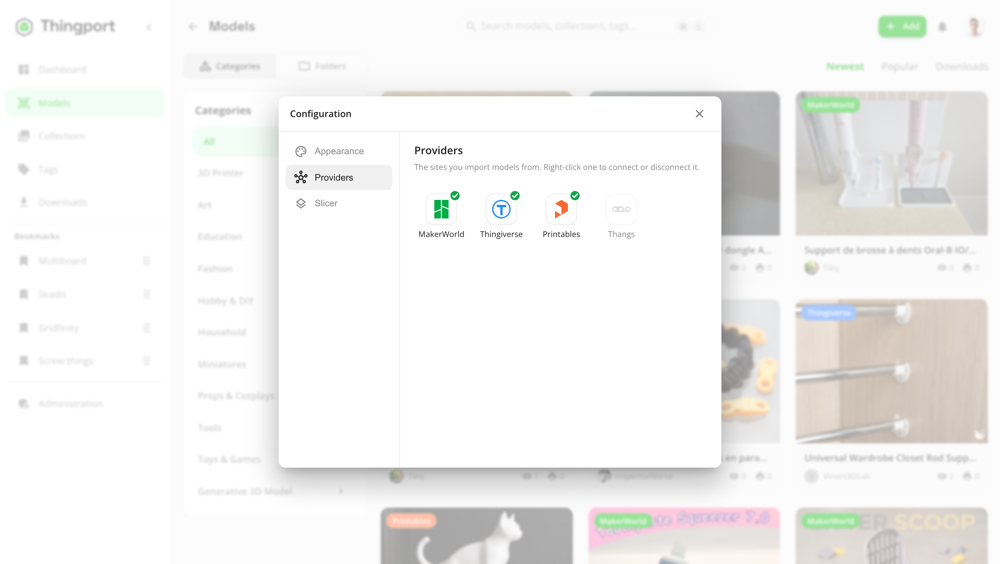

# Provider setup

Importing from **Printables** works out of the box (its public API needs no credential). **MakerWorld** and **Thingiverse** each need a credential from your own account before Thingport can import from them.

Connect them under **Configuration → Providers**: open the user menu (your avatar, top right) and choose **Configuration**, or click one of the provider chips at the bottom of that menu. Right-click a provider to connect or disconnect it, or double-click one that isn't connected yet. A green tick means it's connected.

## Thingiverse Access Token

Instance-wide, admin-configured (Configuration > Providers > Thingiverse, or Administration > Settings > Thingiverse Access Token) -- one token is shared by every user's Thingiverse imports. Other users see Thingiverse as connected once an admin has set it up.

1. Sign in to your Thingiverse account, then go to [thingiverse.com/apps/create](https://www.thingiverse.com/apps/create).
2. Register a new app. The name/description don't matter for this; pick whichever Application Type doesn't require a redirect URL (e.g. "Desktop" or "Mobile") -- a "Web App" asks for OAuth details you don't need here.
3. Once created, Thingiverse shows an **Access Token** for it. This is different from your Thingiverse login password -- it's a permanent credential tied to that registered app.
4. Copy it, right-click **Thingiverse** in Thingport's **Configuration > Providers**, choose **Connect** and paste it. Thingport verifies the token against Thingiverse before storing it, so a mistyped or revoked token is rejected immediately with a clear error instead of only failing on the next import.

Treat this token like a password: anyone who has it can use it to act as your Thingiverse app. If it's ever exposed, revoke it from your Thingiverse account's Apps page and generate a new one.

## MakerWorld cookie

Per-user (Configuration > Providers > MakerWorld) -- MakerWorld has no developer API, so importing from it runs as _your own_ logged-in MakerWorld session, captured as a cookie value.

### Easiest: Thingport Grab

The [Thingport Grab](../extension/README.md) browser extension captures this automatically the first time you import something from a MakerWorld tab where you're already logged in -- there's nothing to copy by hand.

### Manual: copy it from your browser

1. Log in at [makerworld.com](https://makerworld.com) in your browser.
2. Open DevTools (`F12`, or `Cmd+Option+I` on macOS).
3. Chrome/Edge: go to the **Application** tab > **Cookies** > `https://makerworld.com`. Firefox: **Storage** tab > **Cookies** > `https://makerworld.com`.
4. Find the cookie named `token` and copy its **Value** column -- just that raw value, nothing else needs adding.
5. Right-click **MakerWorld** in Thingport's **Configuration > Providers**, choose **Connect** and paste it. Thingport verifies it against MakerWorld before storing it, so a stale or mistyped paste is rejected immediately instead of only failing on the next import.

If there's no cookie named `token` (MakerWorld occasionally renames things), use the **Network** tab instead: reload the page, click any request to `makerworld.com`, open its Request Headers, and copy the whole `cookie:` value. Thingport only pulls the `token=...` part out of it and ignores the rest, so pasting the entire header works too.

This is your own MakerWorld login session -- don't share it, and expect to redo this occasionally, since MakerWorld sessions eventually expire.
