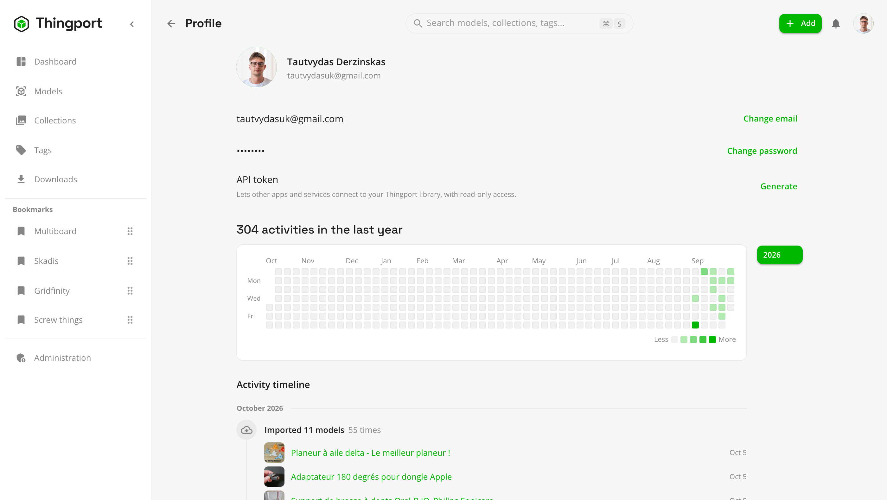

# Connect other apps with an API token

An API token lets another app, script or dashboard read your Thingport library as you, without your password. It
can't change anything: it only reads.

Each user has their own token, and it only sees that user's library.

## Generate a token

1. Open the user menu (your avatar, top right) and choose **Profile**.
2. Next to **API token**, click **Generate**.
3. Copy the token straight away. It's shown only once, and Thingport keeps only a fingerprint of it, so it can't show
   it to you again.



The token starts with `tp_`. Afterwards your profile shows its last four characters, when it was created and when it
was last used, so you can tell which token is in use and whether anything is still using it.

You have one token at a time. To use Thingport from several apps, give them all the same token.

## Use the token

Send the token in the `Authorization` header of each request, as a bearer token. The API is at `/api` on the same
address you open Thingport at:

```bash
curl -H "Authorization: Bearer tp_your_token_here" https://thingport.example.com/api/dashboard/summary
```

That returns your library stats as JSON: how many models, collections, authors and categories you have, plus your most
viewed, most printed and most recently added models. Searching works the same way:

```bash
curl -H "Authorization: Bearer tp_your_token_here" "https://thingport.example.com/api/search?q=benchy"
```

The token works only in the header. Putting it in the address as `?token=...` is refused, because addresses end up in
browser history and proxy logs.

## What a token can and can't do

- **Read:** anything you can see in Thingport yourself, such as models, collections, tags, search, the dashboard and
  your activity.
- **Not write:** any request that would add, change or delete something is refused with `403 API tokens are read-only`.
- **Not manage itself:** a token can't be used to generate a new token, revoke one or sign in, so a leaked token can't
  be turned into anything more.
- **Not reach administration:** even an admin's token can't open the admin pages or settings, which hold instance
  secrets such as email and Thingiverse credentials.

## Replace or revoke a token

On your **Profile**:

- **Regenerate** creates a new token. The old one stops working at once, so update anything that used it.
- **Revoke** removes the token. Anything using it loses access straight away.

Do either if a token might have leaked. Generating and revoking tokens are recorded in the admin logs.

Treat the token like a password: anyone who has it can read your whole library.
