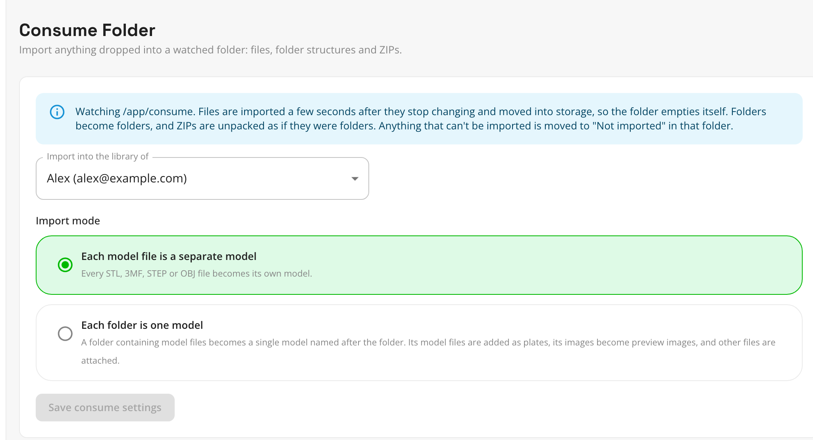

# Import a library with the consume folder

The consume folder is a folder on your server that Thingport watches. Copy files, folder trees or ZIPs into it and
Thingport imports them on its own, then empties the folder. Nothing runs in a browser, so it suits big libraries,
libraries already on a NAS, and anything you want to add on a schedule, for example from a sync tool.

## 1. Mount the folder (once, by whoever runs the server)

Add a volume to the **backend** service in your `docker-compose.yml`, pointing a folder on the host at
`/app/consume`. The install files ship with this line commented out, so you can just uncomment it and set the path:

```yaml
services:
  backend:
    environment:
      - PUID=${PUID:-1000}
      - PGID=${PGID:-1000}
    volumes:
      - thingport_storage:/app/storage
      - /path/to/consume:/app/consume
```

Then apply it:

```bash
docker compose up -d
```

Thingport moves files out of this folder as it imports them, so the user set by `PUID`/`PGID` needs write access to
it. Use the same IDs that own the folder on the host. On Unraid that's usually `99`/`100`. Elsewhere, `id -u` and
`id -g` on the host tell you yours.

## 2. Choose where models go and how

Open **Administration → Settings → Consume Folder**. If the volume is mounted, it says it's watching `/app/consume`.



- **Import into the library of** chooses whose library the models go to. It starts as the first admin account. On a
  shared server, switch it to the person whose library you're importing, then switch it back.
- **Import mode** works like the choice you get when [uploading a folder](upload-folders.md):
  - **Each model file is a separate model** (the default): every STL, 3MF, STEP or OBJ becomes a model, and images
    become models too.
  - **Each folder is one model**: a folder of model files becomes one model named after the folder, with its images as
    photos and its other files attached.

Click **Save consume settings**. You only need to do this again when you want to change something.

## 3. Copy your library in

Copy files, folders or ZIPs into the consume folder, from the server itself, over a network share, or with whatever
sync tool you use. Within a few seconds of the copy finishing, Thingport picks them up:

- Folders become folders in Thingport, however deep.
- A ZIP is unpacked as if it were a folder named after it. If everything in it already sits inside one top folder
  (`Benchy.zip` holding `Benchy/...`), that folder is used rather than nesting it twice. ZIPs can sit anywhere in the
  tree, and unpack where they are.
- Hidden files and system clutter (`.DS_Store`, `Thumbs.db`, `desktop.ini`, `__MACOSX` inside ZIPs) are ignored.
- Imported files are moved into Thingport's storage, and folders left empty are removed, so the consume folder empties
  itself.

Thingport only takes a batch once the files have stopped changing, so a large copy that's still in progress isn't
picked up half-written.

When a batch is done, the owner gets a notification, such as **Imported 42 models from the consume folder**, with how
many files went in. Click it to jump to the new model, or to **Models** when there are several.

**Copy, don't move.** The consume folder removes what it imports, so keep your original library until you've checked
the result.

## What couldn't be imported

Anything Thingport can't import is moved into a **Not imported** folder inside the consume folder, keeping its path,
and the notification says how many files ended up there. That covers:

- files that can't be a model on their own, like a loose `notes.txt` (in "each folder is one model" mode, such files
  inside a model's folder are attached instead)
- ZIPs that are damaged or not really ZIPs
- files over the size limit, 512 MB per file by default (`IMPORT_MAX_MB`)

Thingport never looks inside **Not imported** again, so nothing is retried forever. If a file with the same name is
already there, the new one gets " (2)". To try again, fix the file and move it back into the consume folder.

## Tips for large libraries

- **Do a small batch first.** Copy one folder, check the result in Thingport, then copy the rest.
- **Copy in chunks** of a few thousand files if you want to keep an eye on progress. Each batch sends its own
  notification.
- **Don't drop the same files twice.** Folders are reused, but the models are imported again, with " (2)" after their
  names.

Back to the [overview of ways to bring in your library](existing-library.md).
