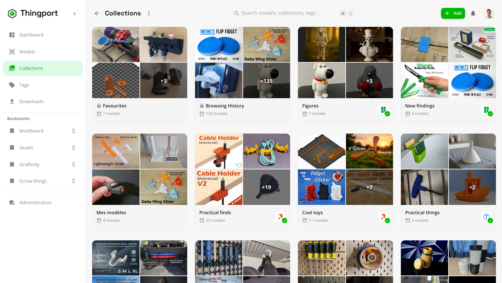

# Synced collections

A synced collection follows a collection on MakerWorld, Printables or Thingiverse. When a model is added to it there,
Thingport imports that model into the matching Thingport collection on its own, without you visiting the page again.

<picture>
  <source media="(prefers-color-scheme: dark)" srcset="../assets/collection-sync-dark.gif">
  
</picture>

## Why sync a collection

- **Keep collecting where you already do.** Save models to a collection on MakerWorld, Printables or Thingiverse as you
  browse, even from your phone, and they turn up in your library later.
- **Follow other people's collections.** Sync a designer's or a friend's public collection, and get each model they
  add to it.
- **A real copy of everything.** Each new model is imported with its files, photos, description, tags and author, so
  it's still yours if the original page goes away.
- **Nothing to remember.** Thingport checks the collection on a schedule and sends a notification saying what came in.
- **Nothing is ever deleted.** Sync only adds. Removing a model from the provider's collection doesn't remove it from
  Thingport.

## Before you start

- Install [Thingport Grab](../../extension/README.md), the browser extension, and connect it to your Thingport. Only
  Grab can turn sync on, because it has just seen which models the collection holds.
- Connect the provider under **Configuration → Providers** where it needs it (see
  [provider setup](../PROVIDER_SETUP.md)). Printables needs nothing. MakerWorld needs your session cookie to import
  models, and to read a private collection. Thingiverse needs an access token.

## Turn sync on

1. Open the collection's page on MakerWorld, Printables or Thingiverse. A Thingiverse user's **Likes** page works too.
2. Click the Thingport Grab button in the bottom-right corner. The panel lists the models in the collection.
3. Tick **Keep this collection in sync** (**Keep these likes in sync** on a Likes page). It's off by default.
4. Pick the models to import now and click **Import selected** (**Start import** on MakerWorld).

The models already in the collection are imported now, as with any collection import. The ones you leave unticked stay
out: sync only picks up models added **after** you turn it on.

Already imported the collection before? Open its page again, open the panel and tick the box. The panel says
everything is already in your library, and **Save** turns sync on.

## Find it in Thingport

A synced collection's tile on the **Collections** page shows the provider's logo with a green tick.

Open the collection and click the same logo above its models, or choose **⋮ → Sync configuration**, to see how it's
linked:

- **Overview** shows the chain from the provider's collection to yours, when it was last checked and when the next
  check is due, and a link to the collection on the provider's site. **Sync now** checks it right away. **Stop
  syncing** unlinks it.
- **Settings** sets how often it's checked: every hour, 6 hours or 24 hours. For MakerWorld it also sets which print
  profiles each new model brings: the default one, the designer's, or all of them, community ones included.

## How it works

- **On a schedule.** Each synced collection is checked on its own interval, every hour unless you change it. A check
  compares the provider's collection with the models Thingport has already seen there.
- **New models only.** A model that's already in your library is just added to the collection. The rest are queued and
  imported one at a time, a minute apart, so the provider isn't flooded with requests. You get a notification when
  they're in.
- **Seen once, decided once.** A model Thingport has seen in the collection is never brought back by the sync, whether
  you left it unticked or deleted it from your library later.
- **Renames are fine.** The link follows the provider's collection id, so renaming the collection on either side keeps
  it synced.
- **One to one.** A provider collection syncs with one Thingport collection, and the other way round. If a collection
  with the same name already follows another source, the new one gets its own name, such as "Things (MakerWorld)".
- **Rate limits pause it.** If the provider stops the imports, for example with a MakerWorld CAPTCHA or daily download
  limit, the remaining models wait, paused, in **Administration → Import queue** until you start them again.
- **Deleted collections.** If the provider's collection can't be found on two checks in a row, the Thingport collection
  is unsynced and you get a notification. Its models stay. Deleting the Thingport collection removes the sync with it.
- **Sync now** is available again 5 minutes after the last check. Its notification also tells you when there was
  nothing new.

## Turn sync off

Either untick the box in Thingport Grab on the collection's page and save, or use **Stop syncing** in the collection's
sync configuration. The collection and its models stay in Thingport. You can turn sync on again from Grab at any time.

## For admins

Two optional settings, added to the `backend` service's `environment` in `docker-compose.yml`:

- `COLLECTION_SYNC_ENABLED=false` turns off the scheduled checks for every user. **Sync now** still works.
- `COLLECTION_SYNC_ITEM_DELAY_MS` sets the pause between the models a sync imports, in milliseconds. The default is
  `60000`, one minute.

Checks run one collection at a time across all users, since they all reach the providers from the same server.
