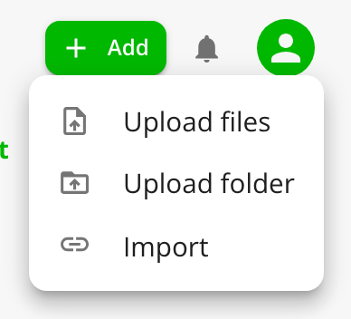
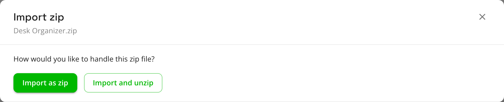
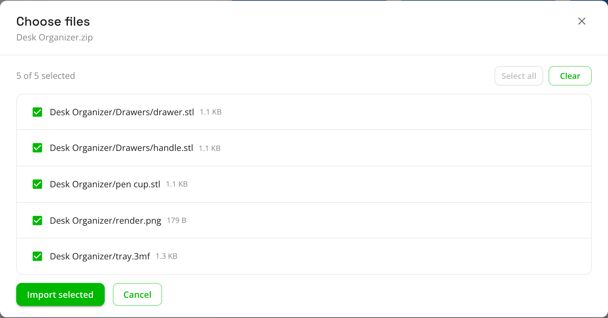

# Upload files and ZIPs

The quickest way to add a few models you already have. Everything happens in the browser, and your original files are
left where they are.

**Supported files:** STL, 3MF, STEP/STP, OBJ, F3D and LightBurn (`.lbrn`, `.lbrn2`) models, images (PNG, JPG, WebP,
BMP, GIF, SVG), and ZIP archives. Each file can be up to 512 MB by default.

## Upload one file

1. Click **Add** at the top right, then **Upload files**.
2. Pick the file.

The model is named after the file (`Benchy.stl` becomes "Benchy") and opens straight in its edit dialog, so you can
fix the title, add tags and notes, and choose a category or folder before you move on. A 3MF that carries a thumbnail, as most
slicer projects do, uses it right away. For an STL or OBJ, Thingport renders a thumbnail the first time the model is
shown.

To put new models straight into an existing folder, open that folder on the **Models** page before you upload.

## Upload several files at once

Select several files in the picker. Thingport asks how to import them:

- **Import as separate prints** makes each file its own model, named after the file.
- **Import as one model with several files** puts them all in a single new model, for when the files belong together,
  like the parts of one print. STL, 3MF, STEP and OBJ files are added in the order you picked them, and anything
  else, such as a photo or a PDF, is attached to the model.

Close the dialog to cancel without uploading anything.

## Upload a ZIP

Pick a `.zip` in **Upload files**, on its own or alongside other files. For each ZIP, Thingport asks what to do with it:

- **Import as zip** keeps the archive whole, as one model named after it. Use this when the ZIP is the thing you want to
  keep, for example a designer's release you might download again.
- **Import and unzip** opens the archive and lists everything in it, all ticked.

Untick what you don't want, or use **Clear** and tick just the files you need, then click **Import selected**.

When you unzip:

- Each model file becomes its own model, and each image its own model too. Untick images if you don't want them as
  models.
- Folders inside the ZIP become folders in Thingport, however deeply nested. `Desk Organizer/Drawers/drawer.stl`
  becomes a "drawer" model in a **Drawers** folder inside a **Desk Organizer** folder.
- Files Thingport can't use on their own, like text files and PDFs, are skipped.
- Junk that macOS adds to archives (`__MACOSX`, `.DS_Store`) is left out of the list.

If you pick several ZIPs, Thingport asks about each in turn. Files you picked alongside them upload first.

When a ZIP holds a library organized as one model per folder, extract it and use [Upload a folder](upload-folders.md)
with **Each folder is one model** instead. Unzipping in the browser always makes one model per file.

## When something goes wrong

- **"Unable to read zip contents"** means the archive is damaged or isn't really a ZIP. You can still choose
  **Import as zip** to keep it as is.
- **Very large ZIPs** are unpacked in your browser's memory, which can be slow or fail for multi-gigabyte archives. Put
  those in the [consume folder](consume-folder.md) instead, which unpacks them on the server.

Next: [upload a whole folder](upload-folders.md), or go back to the
[overview of ways to bring in your library](existing-library.md).
