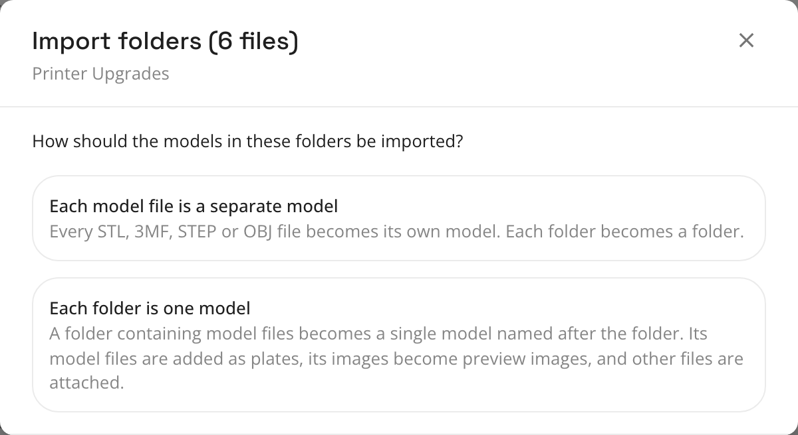

# Upload a folder

Pick a folder on your computer and Thingport uploads everything in it, recreating its folder tree. This is the easiest
way to bring in an organized library from the browser. Your originals stay where they are.

## Step by step

1. Click **Add** at the top right, then **Upload folder**.
2. Pick the folder. You pick one folder at a time; everything inside it, however deep, comes along. Your browser may
   ask you to confirm uploading that many files. That's the browser checking, not Thingport.
3. If the folder contains model files (STL, 3MF, STEP or OBJ), Thingport asks how to import them:

   

4. Keep the tab open until you see **Uploaded N models**. Files upload one after another, so a big tree takes a while.

The folder you picked becomes a folder in Thingport too. To put the whole tree inside an existing folder, open that
folder on the **Models** page before you upload.

Hidden files and system clutter (anything starting with a dot, `.DS_Store`, `Thumbs.db`, `desktop.ini`) are skipped.

## Each model file is a separate model

Every model file becomes its own model, named after the file, and every directory becomes a folder. Images become
models of their own too. Text files, PDFs and other files that can't be a model on their own are skipped.

```text
Miniatures/                         Folders: Miniatures › Dragons, Miniatures › Knights
  Dragons/red dragon.stl     →      Models:  "red dragon", "green dragon" in Dragons
  Dragons/green dragon.stl                   "knight" in Knights
  Knights/knight.stl
```

## Each folder is one model

Each folder that directly contains model files becomes **one** model, named after the folder:

- its STL, 3MF, STEP and OBJ files become the model's files, in name order
- its images (PNG, JPG, WebP or BMP, up to 8 MB) become the model's photos, and the first one becomes the thumbnail
  if the model files don't carry one
- everything else, like a PDF manual, a readme or slicer settings, is attached to the model

The folders above it become folders in Thingport.

```text
Printer Upgrades/                    Folder: Printer Upgrades
  Cable Chain/chain link.stl   →     Models: "Cable Chain" with 2 files and 1 photo
  Cable Chain/end mount.stl                  "Fan Duct" with 1 file and print settings.txt attached
  Cable Chain/photo.png
  Fan Duct/fan duct.3mf
  Fan Duct/print settings.txt
```

A few details worth knowing:

- If model files sit directly in the folder you picked, that folder itself becomes the model.
- Files in a folder without any model files are uploaded one per file, as in the other mode.
- This is the right choice for downloads from MakerWorld, Printables and Thingiverse that you unpacked into a folder
  each. Every download ends up as one tidy model.

## ZIPs inside the folder

ZIPs aren't counted with the folder's other files. After the folder upload, Thingport asks about each ZIP it found, just
like [uploading a ZIP](upload-files.md#upload-a-zip). If you unzip it, its contents go into the folder where the ZIP was.

## Uploading the same folder again

Thingport reuses the folders it already made for that tree, so you won't get a second **Printer Upgrades** folder.
The models are added again though, with " (2)" after their names. To add new models to an imported tree, upload just
the new subfolder, with the matching folder open on the **Models** page.

## Big libraries

Folder upload runs in your browser and needs the tab open until it finishes. For tens of thousands of files, or a
library that already lives on your server or NAS, use the [consume folder](consume-folder.md) instead. It does the
same job on the server, with no browser involved.

Back to the [overview of ways to bring in your library](existing-library.md).
