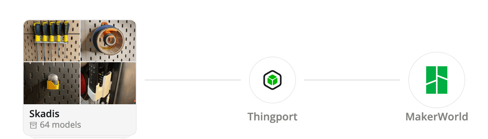
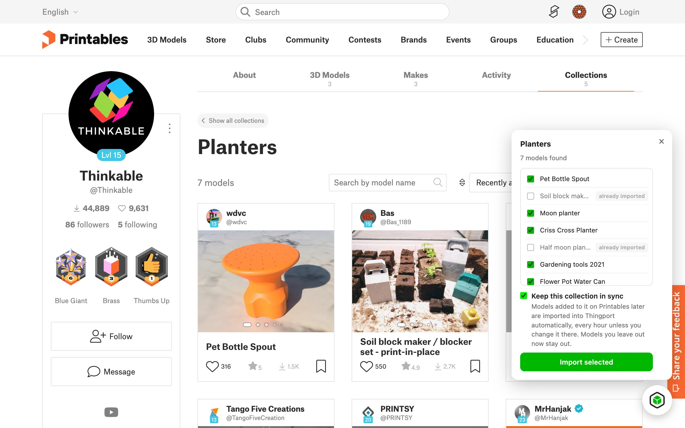
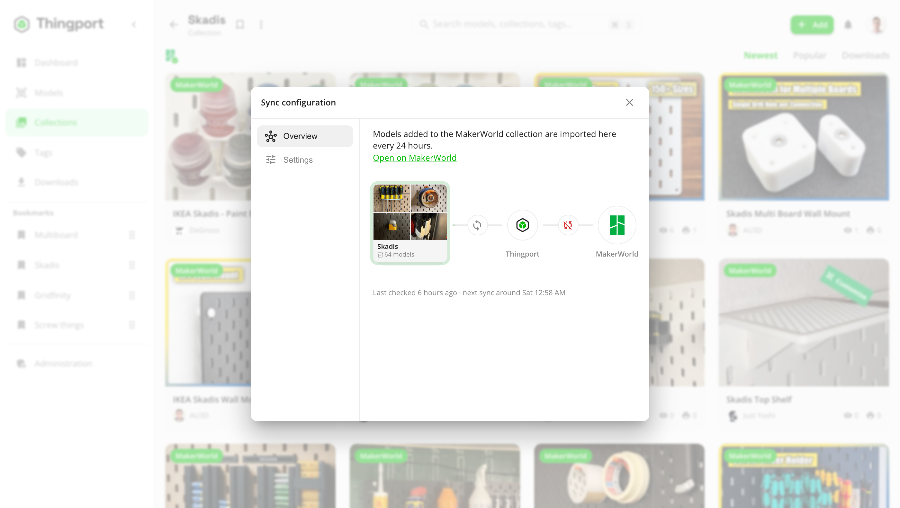

Importing a collection into Thingport has always been a one-off: you get every model that's in it today. Save another
model to that collection next week and you'd have to go back and import it again.

**Synced collections fix that.** Link a MakerWorld, Printables or Thingiverse collection to Thingport once, and every
model added to it from then on comes into your library by itself.

<picture>
  <source media="(prefers-color-scheme: dark)" srcset="../../../../docs/assets/collection-sync-dark.gif">
  
</picture>

## Why it's useful

- **Keep collecting where you already do.** Save models to a collection while you browse a site, even on your phone,
  and they're in Thingport the next time you look.
- **Follow other people's collections.** Sync a designer's or a friend's public collection, or a Thingiverse user's
  likes, and get each model they add.
- **A real copy, not a bookmark.** Each new model comes in with its files, photos, description, tags and author.

## Turning it on

Open the collection's page on MakerWorld, Printables or Thingiverse, open [Thingport Grab](/docs/grab/), and tick
**Keep this collection in sync**. Pick the models you want now and import them as usual. Already imported the
collection before? Tick the box and click **Save**.

## What happens next

Thingport checks the collection every hour (or every 6 or 24 hours, if you'd rather) and imports what's new, one model
at a time, a minute apart, so the provider's limits aren't hit. A notification tells you what came in.

Synced collections show the provider's logo on the Collections page. Open one and click the logo to see its sync
configuration: when it was last checked, when the next check is due, **Sync now**, **Stop syncing**, and settings such
as which MakerWorld print profiles each new model brings.

A few things it deliberately doesn't do:

- **It never deletes.** A model removed from the provider's collection stays in Thingport.
- **It doesn't bring things back.** Models you left out when you turned sync on, or deleted from your library later,
  stay out.
- **It doesn't break on renames.** Rename the collection on either side and it stays linked.

## Get it

Synced collections need the latest Thingport images and Thingport Grab 1.4.0 or newer, for Chrome, Edge and Firefox.
Pull the new images with `docker compose pull && docker compose up -d`, and your browser updates Grab on its own.

The [synced collections guide](/docs/guides/synced-collections/) covers the details: what each provider needs, how
rate limits and deleted collections are handled, and the settings admins can change.
